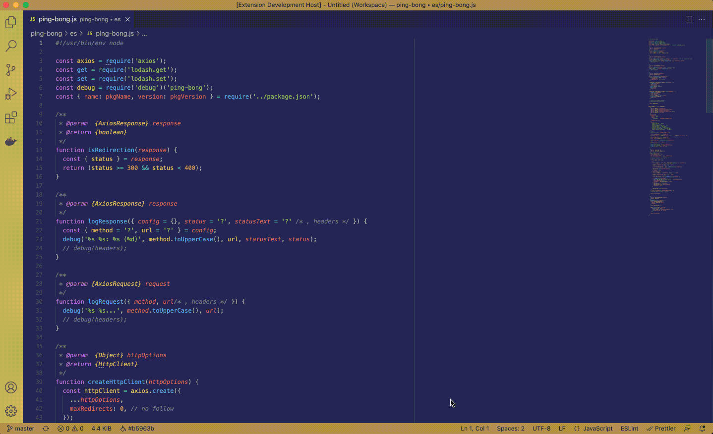

# 💡 JS Code Insights for VSCode

A [Visual Studio Code](https://code.visualstudio.com/) extension to gain insights into your JavaScript code.

## Usage

⚠️ It is not yet published on the VSCode extension marketplace.

To use it:

- Clone the project: `git clone https://github.com/mawrkus/vscode-js-code-insights.git`
- Open the cloned folder in VSCode `cd vscode-js-code-insights && code .`
- Press `F5` to open a new window with your extension loaded
- Open any JavaScript or React file
- Run the command from the command palette by pressing (`Ctrl+Shift+P` or `Cmd+Shift+P` on Mac) and typing `JS Code Insights`.

## Available insights

### Identifier analysis

Computes the identifier density of your JavaScript/React files and display them in a Markdown table report:



## Release Notes

[Have a look at our CHANGELOG](./CHANGELOG.md) to get the details of all changes between versions.

### Versioning

We follow [SemVer](https://semver.org/) convention for versionning.

That means our releases use the following format:

```
<major>.<minor>.<patch>
```

- Breaking changes bump `<major>` (and reset `<minor>` & `<patch>`)
- Backward compatible changes bump `<minor>` (and reset `<patch>`)
- Bug fixes bump `<patch>`

## Contributing

- Fork, clone
- Create your feature branch: `git checkout -b feature/my-new-feature`
- Commit your changes: `git commit -am 'feat(MyNewFeature): Added my new feature'` (the project uses [conventional commits with a scope](https://www.conventionalcommits.org/en/v1.0.0-beta.4/#commit-message-with-scope))
- Check the test: `npm run test`
- Push to the branch: `git push origin my-new-feature`
- Submit a pull request :D
